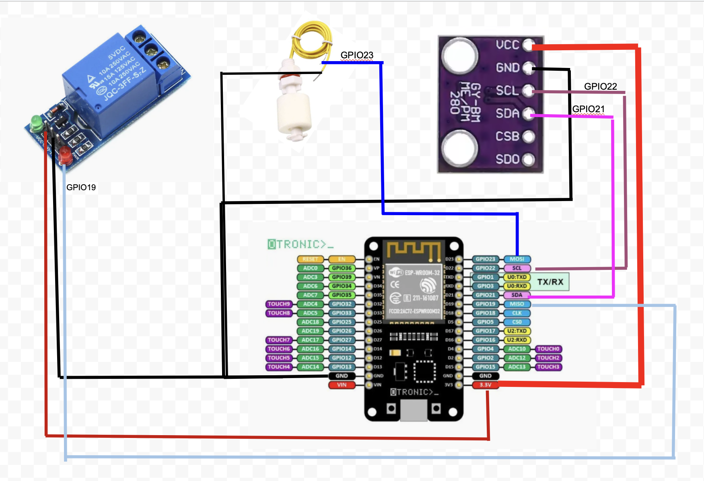

# Automated Irrigation System with ESP32

## Goal
This project aims to create an automated irrigation system with the following requirements:

- **Water level monitoring:** Ensures that there is enough water in the well using a water level sensor (`Capteur sécurité eau`).
- **Wi-Fi connectivity:** Once connected to Wi-Fi, it checks a Google Sheet to determine how much watering is needed based on seasonal data (water requirements vary depending on the time of year).
- **Irrigation control:** Automatically irrigates plants based on the data from the Google Sheet.
- **Sleep mode:** After irrigation, the system goes into sleep mode for 24 hours before the next cycle.

## Hardware
- **ESP32**: The main microcontroller used to manage the irrigation system, connect to Wi-Fi, and control other components.
- **BME280**: Sensor for monitoring environmental conditions such as temperature, humidity, and pressure (to potentially optimize irrigation or monitor plant health).

## Circuit Diagram
Below is the schematic diagram of the system:

## Features
- Monitor water level to prevent dry periods.
- Check Google Sheet for seasonal watering schedules.
- Control irrigation based on scheduled needs.
- Power-saving sleep mode for energy efficiency.

## Installation
1. Clone this repository to your local machine.
2. Set up your **ESP32** and install the necessary libraries (e.g., `WiFi`, `HTTPClient`, `Adafruit_Sensor`, `BME280`).
3. Connect the ESP32 to the water level sensor and BME280.
4. Configure Wi-Fi credentials and Google Sheets API for data retrieval.
5. Upload the code to your ESP32.

## Usage
- The system automatically connects to Wi-Fi upon startup.
- It will read the Google Sheet to determine watering needs based on the current date and season.
- After irrigation, the system will sleep for 24 hours before re-checking the water level and irrigation schedule.

## Future Improvements
- Integration with weather forecast APIs to adjust watering based on real-time weather conditions.
- Web or mobile interface to monitor system status and adjust settings.
- Add multiple sensors for more advanced monitoring (soil moisture, pH levels, etc.).

## Acknowledgements
- ESP32: https://www.espressif.com/en/products/hardware/esp32/overview
- BME280: https://www.bosch-sensortec.com/products/environmental-sensors/humidity-sensors-bme280
